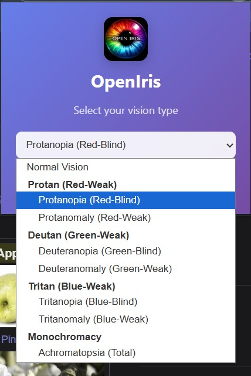

  
   
  

# 👁️ OpenIris

**OpenIris** is a high-performance Chrome Extension designed to improve web accessibility for individuals with Color Vision Deficiency (CVD). It combines real-time webpage color correction  to help users navigate both the digital and physical worlds with clarity.

---

## ✨ Key Features

- **Smart Web Correction**: Injects scientific SVG color matrices into any website to assist with Red, Green, and Blue deficiencies.
- **Comprehensive Profiles**: Supports both **Anopia** (Total Blindness) and **Anomaly** (Partial Weakness) for:
  - Protan (Red)
  - Deutan (Green)
  - Tritan (Blue)
  - Monochromacy (Total)
- **Sleek UI**: Modern, aesthetic interface with a clean gradient design and intuitive controls.

---

## 🚀 Installation (Local Development)

Since this extension is currently in development, follow these steps to run it locally:

1. **Download the Project**: 
   - Clone this repository: `git clone https://github.com/YOUR_USERNAME/OpenIris.git`
   - Or download and extract the ZIP file.

2. **Open Extensions Page**:
   - Open Chrome and navigate to `chrome://extensions/`.

3. **Enable Developer Mode**:
   - Toggle the **Developer mode** switch in the top-right corner to **ON**.

4. **Load the Extension**:
   - Click **Load unpacked** in the top-left.
   - Select the root folder of this project (the one containing `manifest.json`).

5. **Pin for Easy Access**:
   - Click the **Puzzle** icon in the toolbar and pin **OpenIris**.

---

## 🛠️ Technical Details

OpenIris uses hardware-accelerated **SVG `<feColorMatrix>`** filters. This approach allows for:
- **Zero Lag**: Color shifting is handled by the browser's rendering engine.
- **High Accuracy**: Matrices are calibrated to specific scientific wavelengths for CVD simulation.

### Project Structure
- `manifest.json`: Extension configuration and permissions.
- `popup.html/css/js`: The main user interface and control logic.
- `content.js`: Script responsible for injecting filters into active web tabs.
---
